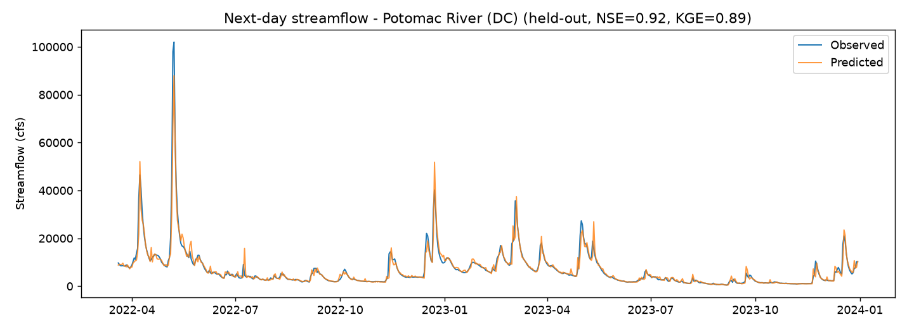
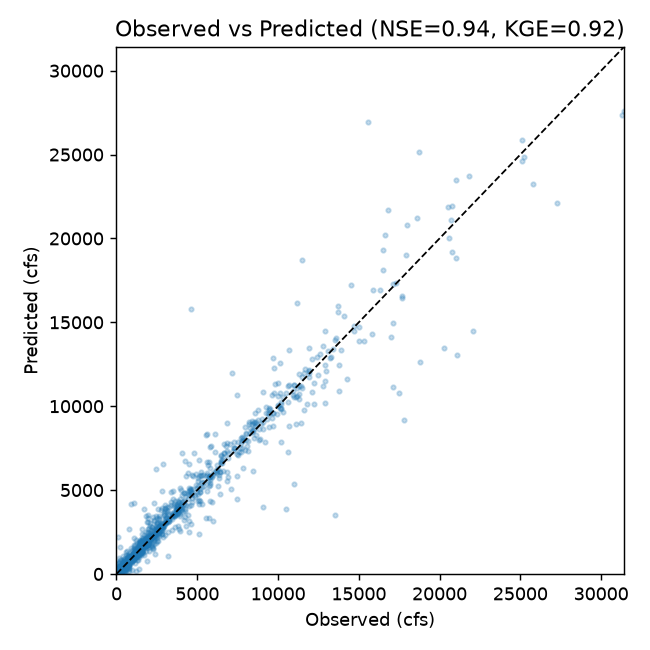
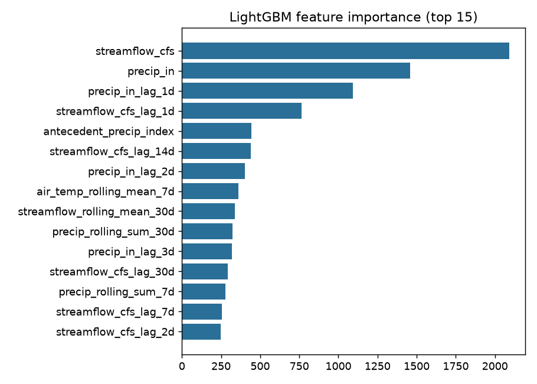

# Streamflow Forecasting — LightGBM on USGS + NASA POWER

> **Résumé line:** Built a reproducible daily **streamflow forecasting** pipeline over 4 US river basins (2015–2023) using **gradient-boosted trees (LightGBM)** on USGS discharge + NASA POWER meteorology. Achieved **NSE 0.94 / KGE 0.92** on a held-out test period, with **leave-one-basin-out** generalization to unseen basins (NSE up to 0.74) evaluated with standard hydrology metrics.

**Headline result (held-out 2022–2023, all basins pooled):**

| Metric | Value |
| --- | --- |
| NSE (Nash–Sutcliffe Efficiency) | **0.944** |
| KGE (Kling–Gupta Efficiency) | **0.918** |
| RMSE | 1,222 cfs |
| MAE | 304 cfs |



*Potomac River near Washington, DC — next-day streamflow on the held-out period. The model tracks both the spring 2022 flood peak (~100,000 cfs) and the recession limbs.*

---

## What this is

A compact, recruiter-verifiable machine-learning pipeline for **next-day streamflow (river discharge) prediction**. Clone, install, run one command, and reproduce the hydrological skill metrics that are standard in the rainfall–runoff literature (NSE, KGE, RMSE, MAE, R²).

It is a **large-sample / CAMELS-style** setup — multiple basins, time-based evaluation, and an explicit *leave-one-basin-out* test — but it builds its own dataset from two public APIs rather than shipping the multi-gigabyte CAMELS files, so the data step is fully reproducible from scratch.

---

## Data

Streamflow gauges do **not** record precipitation or temperature, so meteorology is sourced separately and merged per basin by date. This makes the task a genuine **rainfall–runoff** problem, not pure streamflow autoregression.

| Source | Variable | Access |
| --- | --- | --- |
| **USGS NWIS** | Observed daily mean discharge (cfs), parameter `00060` — the prediction target | [`dataretrieval`](https://pypi.org/project/dataretrieval/) |
| **NASA POWER** | Daily precipitation (`PRECTOTCORR`) + 2 m air temperature (`T2M`) at each gauge's coordinates | Public REST API (stdlib `urllib`, no extra dependency) |

**Basins (humid, eastern/midwest US):**

| USGS site | River | Lat, Lon |
| --- | --- | --- |
| 01646500 | Potomac River (DC) | 38.95, −77.13 |
| 01491000 | Choptank River (MD) | 39.00, −75.79 |
| 03339000 | Vermilion River (IL) | 40.10, −87.60 |
| 04085427 | Manitowoc River (WI) | 44.11, −87.72 |

---

## Method

- **Features** (`src/features.py`): lagged discharge & precipitation (1–7, 14, 30 days), rolling means/sums, day-of-year sin/cos seasonality, and an antecedent precipitation index. Every feature is built with a `.shift()` so **no future information leaks** into a prediction. Target = next-day discharge.
- **Model** (`src/train.py`): `LightGBMRegressor` (400 trees, lr 0.03). Chosen for strong tabular performance, fast training, and interpretable feature importance.
- **Evaluation** (`src/evaluate.py`): NSE, KGE, RMSE, MAE, R². The **train/test split is chronological** (test is strictly later in time), and generalization is stress-tested with **leave-one-basin-out** (train on 3 basins, predict the unseen 4th).
- **LSTM baseline:** intentionally left as a documented stub (`lstm_baseline_stub`) — a clearly-marked future extension, not a claimed result.

---

## Results

**Per-basin skill on the held-out period** (single pooled model, tested on each basin separately):

| Basin | NSE | Note |
| --- | --- | --- |
| Potomac (01646500) | **0.92** | Strong |
| Vermilion (03339000) | **0.91** | Strong |
| Manitowoc (04085427) | **0.81** | Strong |
| Choptank (01491000) | **−0.76** | Underperforms — see below |

**Leave-one-basin-out** (model never sees the test basin during training):

| Held-out basin | NSE |
| --- | --- |
| Vermilion | 0.74 |
| Manitowoc | 0.73 |
| Potomac | 0.13 |
| Choptank | −1.44 |




## Interpretation & honest limitations

- **The pooled model generalizes well to 3 of 4 basins** but **fails on the Choptank** (negative NSE in both the in-basin holdout and leave-one-basin-out). The Choptank is a small, slow coastal-plain river with tidal influence; its flow scale and regime differ sharply from the larger inland basins, so a single pooled model — dominated by the high-discharge basins — predicts it worse than its own long-term mean. This is exactly the **basin-heterogeneity** problem that motivates the CAMELS research program.
- **Feature importance** is dominated by recent lagged discharge and rolling flow, with precipitation/seasonality as secondary drivers — physically sensible for daily forecasting, where flow has strong short-horizon persistence.
- **Honest reading of the headline NSE:** 0.94 pooled is inflated by the large-discharge basins; the per-basin numbers (0.81–0.92 on the three that work) are the fairer statement of skill. High NSE on humid, well-gauged basins is *expected*, not a guarantee that transfers to arid or flashy catchments.
- **Clear next steps** (to fix Choptank and improve transfer): predict in **log space** (`log1p(Q)`) to handle the orders-of-magnitude scale spread; add **static catchment attributes** (drainage area, slope, soils — the CAMELS attributes) so the model can condition on basin type; per-basin normalization; and implement the **LSTM** baseline for comparison.

---

## How to run

```bash
pip install -r requirements.txt

# Full demo: build dataset → train → NSE/KGE + leave-one-basin-out → plots
python run_demo.py            # writes outputs/metrics.json + 3 PNGs

# Core training entry point only (pooled model + metrics.json)
python -m src.train
```

Both fetch live data from USGS and NASA POWER, so an internet connection is required on first run.

## Repository layout

```
src/data.py       USGS streamflow + NASA POWER weather, merged per basin
src/features.py   leakage-safe lag / rolling / seasonal feature engineering
src/train.py      LightGBM training + metrics (+ LSTM stub)
src/evaluate.py   NSE, KGE, and the full metric table
run_demo.py       end-to-end run: pooled + per-basin + leave-one-basin-out + plots
outputs/          metrics.json and the generated figures
```
